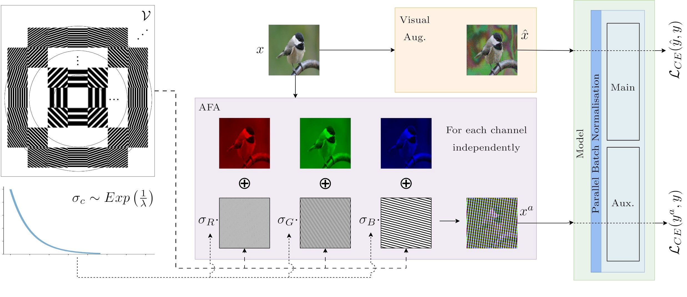

# Auxiliary Fourier Augmentation
This repository contains the code for the paper "Fourier-basis Functions to Bridge Augmentation Gap: Rethinking Frequency Augmentation in Image Classification" accepted at CVPR 2024.

## Introduction
We propose Auxiliary Fourier-basis Augmentation (AFA), a complementary technique targeting augmentation in the frequency domain and filling the robustness gap left by visual augmentations. 
We demonstrate the utility of augmentation via Fourier-basis additive noise in a straightforward and efficient adversarial setting.
Our results show that AFA benefits the robustness of models against common corruptions, OOD generalization, and consistency of performance of models against increasing perturbations, with negligible deficit to the standard performance of models over various benchmarks and resolutions. 
It can be seamlessly integrated with other augmentation techniques to further boost performance. 

For more details see our [CVPR 2024 paper: Fourier-basis Functions to Bridge Augmentation Gap: Rethinking Frequency Augmentation in Image Classification](https://arxiv.org/abs/2403.01944)

## Schema



## Contents

This directory includes a reference implementation in PyTorch of the augmentation method used in AFA.

We also include PyTorch re-implementations of AFA on both CIFAR-10/100 and ImageNet which both support training and evaluation on CIFAR-10/100-C and ImageNet-C.

## Experiment Setups

The following snippets are an example of how to use the ConfigBuilder to create a config object

```python

experiments = [
    # This creates the experimental setup for training ImageNet using ResNet50-Dubin model
    # The training is done with the AFA attack and the mean strength is set to 10 and the minimum strength is set to 0
    # It does not use JSD and so defaults to use of ACE loss as there is an attack specified
    # It does not use mix like CutMix or MixUp
    # No other augmentations are used
    {
        'ds': 'in', 'm': 'rn50_dubin', 'use_jsd': False,
        'use_prime': False, 'use_augmix': False, 'in_mix': False, 'use_mix': False,
        'use_fourier': False, 'use_apr': False, 'attack': 'afa', 'min_str': 0., 'mean_str': 10.,
    },

    # This creates the experimental setup for training ImageNet using CCT model
    # The training is done with the AFA attack and the mean strength is set to 10 and the minimum strength is set to 0
    # It does not use JSD and so defaults to use of ACE loss as there is an attack specified
    # It uses mix like CutMix or MixUp
    # It uses AugMix besides the AFA augmentation
    {
        'ds': 'in', 'm': 'cct_14_7x2_224', 'use_jsd': False,
        'use_prime': False, 'use_augmix': True, 'in_mix': False, 'use_mix': True,
        'use_fourier': False, 'use_apr': False, 'attack': 'afa', 'min_str': 0., 'mean_str': 10.,
    },
]
```

The ```experiment``` variable is a list of dictionaries, each dictionary represents an experimental setup.
Specify the ```experiment``` list in the ```main.py``` file and run the file to start the experiments.

Look at ```config_utils.py``` for more details on the ConfigBuilder class and experimental setups.

## Running the Experiments

First install the requirements using the following command:
```bash
pip install -r requirements.txt
```

Then, construct the config object using the ConfigBuilder class and specify the experiments in the ```main.py``` file.
This is shown above.

To run the experiments, use the following command:
```bash
python main.py
```

## Requirements
- PyTorch
- Numpy
- Matplotlib
- einops, opt_einsum
- tqdm
- ml-collections
- torchvision
- pytorch_lightning
- wandb
- torchmetrics
- thop

## Pretrained Models
The process to load pretrained models for ImageNet can be found [here](./pretrained) using the ```load_weights.py``` script. Pretrained weights can be downloaded as decribed below:

For ImageNet, all models have been moved to Zenodo and can be downloaded [here](https://zenodo.org/records/13755777).
For CIFAR-10, all model weights are available [here](https://zenodo.org/records/11059640).

## Evaluations
We refer to: [CorruptionBenchCV](https://github.com/nis-research/CorruptionBenchCV) for the corruption benchmark tests on ImageNet-C, ImageNet-\bar{C}, ImageNet-3DCC and ImageNet-P, and the [ImageNet-v2](https://github.com/modestyachts/ImageNetV2) and [ImageNet-R](https://github.com/hendrycks/imagenet-r) for the OOD tests.

The Fourier heatmaps of models are plotted using [this repository](https://github.com/gatheluck/FourierHeatmap).

## Citation
If you find this repository useful, please consider citing our paper:
```
@inproceedings{afa,
  title={Fourier-basis functions to bridge augmentation gap: Rethinking frequency augmentation in image classification},
  author={Vaish, Puru and Wang, Shunxin and Strisciuglio, Nicola},
  booktitle={Proceedings of the IEEE/CVF Conference on Computer Vision and Pattern Recognition},
  pages={17763--17772},
  year={2024}
}
```

## License
This repository is released under the Apache 2.0 license. See [LICENSE](./LICENSE) for more details.
